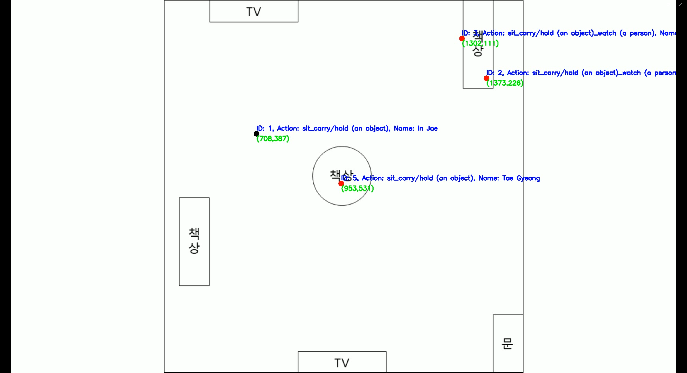
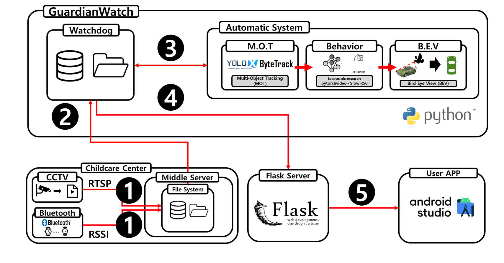

# GuardianWatch
Intelligent Childcare Center Safety Monitoring System

> Using Multi-Object Tracking & Computer Vision Technology.

A system that analyzes the daily life of a child at a childcare center.

# Overview
|CCTV 원본|➡️|객체/행동 분석|➡️|BEV|
|:---:|:---:|:---:|:---:|:---:|
||➡️||➡️||


# Environments
* &nbsp;OS : Linux Ubuntu 20.04.6 LTS
* CPU : Intel i9-9900KF
* RAM : 64G
* GPU : RTX 2080Ti 11GB
* CUDA : 11.7

# Main Skills
- Python 3.11.5
- Flask 2.2.2
- WatchDog 2.1.6
- MySQL 5.7.24

# Library
* packagelist.txt
* requirements.txt

# Structure

<details>
<summary>File Structure</summary>

```
koren
 ┣ code
 ┃ ┣ BTmapping
 ┃ ┣ ByteTrack
 ┃ ┣ KOREN_Flask
 ┃ ┃ ┣ profile_image
 ┃ ┃ ┃ ┗ test
 ┃ ┃ ┃ ┃ ┗ 홍길
 ┃ ┃ ┃ ┃ ┃ ┣ 1.png
 ┃ ┃ ┃ ┃ ┃ ┗ back.png
 ┃ ┃ ┣ app.py
 ┃ ┃ ┣ db_info.json
 ┃ ┃ ┗ requirements.txt
 ┃ ┣ automatize
 ┃ ┃ ┣ BEV.py
 ┃ ┃ ┣ automation.py
 ┃ ┃ ┣ automation_v2.py
 ┃ ┃ ┣ ava_action_list.pbtxt
 ┃ ┃ ┣ behavior_prediction.py
 ┃ ┃ ┣ heatmap.py
 ┃ ┃ ┣ kinetics_classnames.json
 ┃ ┃ ┣ mapping.py
 ┃ ┃ ┣ model_test.ipynb
 ┃ ┃ ┣ motBetween.py
 ┃ ┃ ┣ motToTxt.py
 ┃ ┃ ┣ move_ana.py
 ┃ ┃ ┣ ori_behavior_prediction.py
 ┃ ┃ ┣ test_run.sh
 ┃ ┃ ┣ transBT_modify.py
 ┃ ┃ ┗ your_info.json
 ┃ ┣ CH01_20230831162648_163118.mp4
 ┃ ┣ ava_action_list.pbtxt
 ┃ ┣ model_test.ipynb
 ┃ ┣ packagelist.txt
 ┃ ┣ requirements.txt
 ┃ ┗ theatre.webm
 ┃
 ┣ KOREN
 ┃ ┣ Bluetooth
 ┃ ┃ ┗ 2023
 ┃ ┃ ┃ ┗ 10
 ┃ ┃ ┃ ┃ ┣ 15
 ┃ ┃ ┃ ┃ ┃ ┗ transBT.txt
 ┃ ┃ ┃ ┃ ┗ 21
 ┃ ┃ ┃ ┃ ┃ ┗ transBT.txt
 ┃ ┗ CCTV
 ┃ ┃ ┗ ch02
 ┃ ┃ ┃ ┗ 2023
 ┃ ┃ ┃ ┃ ┗ 10
 ┃ ┃ ┃ ┃ ┃ ┣ 15
 ┃ ┃ ┃ ┃ ┃ ┃ ┗ 20230831162648.mp4
 ┃ ┃ ┃ ┃ ┃ ┗ 21
 ┃ ┃ ┃ ┃ ┃ ┃ ┗ 20231021144315.mp4
 ┃
 ┣ Output
 ┃ ┣ Action
 ┃ ┃ ┗ ch02
 ┃ ┃ ┃ ┗ 2023
 ┃ ┃ ┃ ┃ ┗ 10
 ┃ ┃ ┃ ┃ ┃ ┣ 15
 ┃ ┃ ┃ ┃ ┃ ┃ ┣ 20230831162648.mp4
 ┃ ┃ ┃ ┃ ┃ ┃ ┗ 20230831162648.txt
 ┃ ┃ ┃ ┃ ┃ ┗ 21
 ┃ ┃ ┃ ┃ ┃ ┃ ┣ 20231021144315.mp4
 ┃ ┃ ┃ ┃ ┃ ┃ ┗ 20231021144315.txt
 ┃ ┣ Analysis
 ┃ ┃ ┣ ch02
 ┃ ┃ ┃ ┗ 2023
 ┃ ┃ ┃ ┃ ┗ 10
 ┃ ┃ ┃ ┃ ┃ ┣ 15
 ┃ ┃ ┃ ┃ ┃ ┃ ┣ 20230831162648
 ┃ ┃ ┃ ┃ ┃ ┃ ┃ ┣ heatmap
 ┃ ┃ ┃ ┃ ┃ ┃ ┃ ┃ ┣ HeatMap_kid1.jpg
 ┃ ┃ ┃ ┃ ┃ ┃ ┃ ┃ ┣ HeatMap_kid2.jpg
 ┃ ┃ ┃ ┃ ┃ ┃ ┃ ┃ ┣ HeatMap_kid3.jpg
 ┃ ┃ ┃ ┃ ┃ ┃ ┃ ┃ ┣ HeatMap_kid4.jpg
 ┃ ┃ ┃ ┃ ┃ ┃ ┃ ┃ ┗ HeatMap_kid5.jpg
 ┃ ┃ ┃ ┃ ┃ ┃ ┃ ┗ path
 ┃ ┃ ┃ ┃ ┃ ┃ ┃ ┃ ┣ path_kid1.jpg
 ┃ ┃ ┃ ┃ ┃ ┃ ┃ ┃ ┣ path_kid2.jpg
 ┃ ┃ ┃ ┃ ┃ ┃ ┃ ┃ ┣ path_kid3.jpg
 ┃ ┃ ┃ ┃ ┃ ┃ ┃ ┃ ┣ path_kid4.jpg
 ┃ ┃ ┃ ┃ ┃ ┃ ┃ ┃ ┗ path_kid5.jpg
 ┃ ┃ ┃ ┃ ┃ ┃ ┣ 20230831162648_moveDistance.csv
 ┃ ┃ ┃ ┃ ┃ ┃ ┣ 20230831162648_useKcal.csv
 ┃ ┃ ┃ ┃ ┃ ┃ ┣ 20230831162648_video_bev.csv
 ┃ ┃ ┃ ┃ ┃ ┃ ┗ 20230831162648_video_bev_Interpolation.csv
 ┃ ┃ ┃ ┃ ┃ ┗ 21
 ┃ ┃ ┃ ┃ ┃ ┃ ┣ 20231021144315
 ┃ ┃ ┃ ┃ ┃ ┃ ┃ ┣ heatmap
 ┃ ┃ ┃ ┃ ┃ ┃ ┃ ┃ ┣ HeatMap_kid1.jpg
 ┃ ┃ ┃ ┃ ┃ ┃ ┃ ┃ ┣ HeatMap_kid2.jpg
 ┃ ┃ ┃ ┃ ┃ ┃ ┃ ┃ ┣ HeatMap_kid3.jpg
 ┃ ┃ ┃ ┃ ┃ ┃ ┃ ┃ ┣ HeatMap_kid4.jpg
 ┃ ┃ ┃ ┃ ┃ ┃ ┃ ┃ ┗ HeatMap_kid5.jpg
 ┃ ┃ ┃ ┃ ┃ ┃ ┃ ┗ path
 ┃ ┃ ┃ ┃ ┃ ┃ ┃ ┃ ┣ path_kid1.jpg
 ┃ ┃ ┃ ┃ ┃ ┃ ┃ ┃ ┣ path_kid2.jpg
 ┃ ┃ ┃ ┃ ┃ ┃ ┃ ┃ ┣ path_kid3.jpg
 ┃ ┃ ┃ ┃ ┃ ┃ ┃ ┃ ┣ path_kid4.jpg
 ┃ ┃ ┃ ┃ ┃ ┃ ┃ ┃ ┗ path_kid5.jpg
 ┃ ┃ ┃ ┃ ┃ ┃ ┣ 20231021144315_moveDistance.csv
 ┃ ┃ ┃ ┃ ┃ ┃ ┣ 20231021144315_useKcal.csv
 ┃ ┃ ┃ ┃ ┃ ┃ ┣ 20231021144315_video_bev.csv
 ┃ ┃ ┃ ┃ ┃ ┃ ┗ 20231021144315_video_bev_Interpolation.csv
 ┃ ┃ ┗ ch04
 ┃ ┃ ┃ ┗ 2023
 ┃ ┃ ┃ ┃ ┗ 10
 ┃ ┃ ┃ ┃ ┃ ┗ 15
 ┃ ┃ ┃ ┃ ┃ ┃ ┗ 20230831162648
 ┃ ┃ ┃ ┃ ┃ ┃ ┃ ┣ heatmap
 ┃ ┃ ┃ ┃ ┃ ┃ ┃ ┃ ┣ HeatMap_kid1.jpg
 ┃ ┃ ┃ ┃ ┃ ┃ ┃ ┃ ┣ HeatMap_kid2.jpg
 ┃ ┃ ┃ ┃ ┃ ┃ ┃ ┃ ┣ HeatMap_kid3.jpg
 ┃ ┃ ┃ ┃ ┃ ┃ ┃ ┃ ┣ HeatMap_kid4.jpg
 ┃ ┃ ┃ ┃ ┃ ┃ ┃ ┃ ┗ HeatMap_kid5.jpg
 ┃ ┃ ┃ ┃ ┃ ┃ ┃ ┗ path
 ┃ ┃ ┃ ┃ ┃ ┃ ┃ ┃ ┣ path_kid1.jpg
 ┃ ┃ ┃ ┃ ┃ ┃ ┃ ┃ ┣ path_kid2.jpg
 ┃ ┃ ┃ ┃ ┃ ┃ ┃ ┃ ┣ path_kid3.jpg
 ┃ ┃ ┃ ┃ ┃ ┃ ┃ ┃ ┣ path_kid4.jpg
 ┃ ┃ ┃ ┃ ┃ ┃ ┃ ┃ ┗ path_kid5.jpg
 ┃ ┣ BEV
 ┃ ┃ ┣ ch02
 ┃ ┃ ┃ ┗ 2023
 ┃ ┃ ┃ ┃ ┗ 10
 ┃ ┃ ┃ ┃ ┃ ┣ 15
 ┃ ┃ ┃ ┃ ┃ ┃ ┣ 20230831162648_video_bev.mp4
 ┃ ┃ ┃ ┃ ┃ ┃ ┗ 20230831162648_video_bev.txt
 ┃ ┃ ┃ ┃ ┃ ┗ 21
 ┃ ┃ ┃ ┃ ┃ ┃ ┣ 20231021144315_video_bev.mp4
 ┃ ┃ ┃ ┃ ┃ ┃ ┗ 20231021144315_video_bev.txt
 ┃ ┃ ┗ ch04
 ┃ ┃ ┃ ┗ 2023
 ┃ ┃ ┃ ┃ ┗ 10
 ┃ ┃ ┃ ┃ ┃ ┗ 15
 ┃ ┃ ┃ ┃ ┃ ┃ ┣ 20230831162648_video_bev.mp4
 ┃ ┃ ┃ ┃ ┃ ┃ ┗ 20230831162648_video_bev.txt
 ┃ ┣ Bluetooth
 ┃ ┃ ┗ 2023
 ┃ ┃ ┃ ┗ 10
 ┃ ┃ ┃ ┃ ┣ 15
 ┃ ┃ ┃ ┃ ┃ ┗ 20230831162648_transBT_modified.txt
 ┃ ┃ ┃ ┃ ┗ 21
 ┃ ┃ ┃ ┃ ┃ ┗ 20231021144315_transBT_modified.txt
 ┃ ┣ MOT
 ┃ ┃ ┗ ch02
 ┃ ┃ ┃ ┗ 2023
 ┃ ┃ ┃ ┃ ┗ 10
 ┃ ┃ ┃ ┃ ┃ ┣ 15
 ┃ ┃ ┃ ┃ ┃ ┃ ┣ 20230831162648.mp4
 ┃ ┃ ┃ ┃ ┃ ┃ ┣ 20230831162648.txt
 ┃ ┃ ┃ ┃ ┃ ┃ ┗ log.txt
 ┃ ┃ ┃ ┃ ┃ ┗ 21
 ┃ ┃ ┃ ┃ ┃ ┃ ┣ 20231021144315.mp4
 ┃ ┃ ┃ ┃ ┃ ┃ ┣ 20231021144315.txt
 ┃ ┃ ┃ ┃ ┃ ┃ ┣ log.txt
 ┃ ┃ ┃ ┃ ┃ ┃ ┗ ori20231021144315.txt
 ┃ ┣ Mapping
 ┃ ┃ ┗ ch02
 ┃ ┃ ┃ ┗ 2023
 ┃ ┃ ┃ ┃ ┗ 10
 ┃ ┃ ┃ ┃ ┃ ┣ 15
 ┃ ┃ ┃ ┃ ┃ ┃ ┗ 20230831162648_mapping.txt
 ┃ ┃ ┃ ┃ ┃ ┗ 21
 ┃ ┃ ┃ ┃ ┃ ┃ ┗ 20231021144315_mapping.txt
 ┃ ┗ Trans
 ┃ ┃ ┗ ch02
 ┃ ┃ ┃ ┗ 2023
 ┃ ┃ ┃ ┃ ┗ 10
 ┃ ┃ ┃ ┃ ┃ ┣ 15
 ┃ ┃ ┃ ┃ ┃ ┃ ┣ 20230831162648_MOTbetween.txt
 ┃ ┃ ┃ ┃ ┃ ┃ ┗ 20230831162648_transMOT.txt
 ┃ ┃ ┃ ┃ ┃ ┗ 21
 ┃ ┃ ┃ ┃ ┃ ┃ ┣ 20231021144315_MOTbetween.txt
 ┃ ┃ ┃ ┃ ┃ ┃ ┗ 20231021144315_transMOT.txt 
```

</details>

<br>

# Install
Please follow the instructions below to install the required packages.

1. Clone this repository
```bash
git clone https://github.com/sts07142/GuardianWatch.git
```

1-1. Clone ByteTrack repository
```bash
cd GuardianWatch/koren/code
git clone https://github.com/ifzhang/ByteTrack.git
```

2. Install Package
```bash
conda create --name guardianwatch python=3.11 -y
conda activate guardianwatch
cd GuardianWatch/koren/code
pip install -r requirements.txt
conda install --file packagelist.txt
```
3. Fill folder with `your own data`
```
This repo offers except videos.(You can `NOT` operate with our given data.)

Check this repo's data structure to fill in your own data.

You should fill in your `Bluetooth data` & `Video data`.
```

# Flow Chart

```
Flow Numbers
1️⃣ 2️⃣ 3️⃣ 4️⃣ 5️⃣
```
# How To Use
1. Setting RTSP to CCTV video & Bluetooth 
```bash
1️⃣
CCTV Video RTSP
Saving in GuardianWatch/koren/KOREN/CCTV/`channel_num`/`year`/`month`/`day`/`yyyyMMddHHmmss.mp4`

example) GuardianWatch/koren/KOREN/CCTV/ch02/2023/10/15/20231015142134.mp4
-----------------------------------------------------------------------------------------------------
Collect Bluetooth RSSI
Use Bluetooth APP to get RSSI values & time 
# Download APP in Equipment to Collect
git clone https://github.com/sts07142/Bluetooth
```
2. Execute WatchDog system to observer CCTV video and Automatic System
```bash
2️⃣,3️⃣
python3 GuardianWatch/koren/code/automatize/automation.py
```

3. Flask server
```bash
4️⃣
cd GuardianWatch/koren/code/KOREN_Flask
python3 app.py
```

4. GuardianWatch APP
```bash
5️⃣
git clone https://github.com/sts07142/guardianwatch_app
```

# Used Equipments / Models
## Equipments
- CCTV : [WiseNet Wireless NVR security system (1080p)](https://www.wisenetlife.com/en-us/product/All-in-One/SNK-B73047BW/feature/)

- Smart Watch : [Samsung Galaxy watch 5 (wifi model)](https://www.samsung.com/global/galaxy/galaxy-watch5/)

## Models
- MOT: [ByteTrack](https://github.com/ifzhang/ByteTrack) + [YoloX](https://github.com/Megvii-BaseDetection/YOLOX)

- Behavior: [SlowR50](https://github.com/facebookresearch/SlowFast)
    - Dataset : [AVA Kinetics 400](https://paperswithcode.com/dataset/ava)

# More Informations
### [Descriptions](https://github.com/sts07142/senior_project)

### [GuardianWatch APP](https://github.com/sts07142/guardianwatch_app)

### [Bluetooth APP](https://github.com/sts07142/Bluetooth)

### [BTmapping](https://github.com/sts07142/BTmapping)

### PPT

### YouTube
